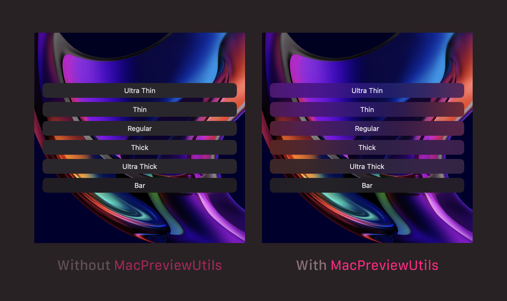

# MacPreviewUtils

This package includes a few tools that I use all the time when developing macOS apps, whether using SwiftUI or AppKit.
These tools help make SwiftUI previews more useful for Mac app developers.

## Translucency Fix

By default, `Material` and other views that rely on an app being active in order to render properly won't look right in SwiftUI previews,
making it difficult to iterate on detailed designs that use such effects.

Just by linking against the MacPreviewUtils library, you'll get an automatic fix for translucency in SwiftUI previews.

### Example:

No code needed, just link your app target (or one of the targets it links against) to MacPreviewUtils.



## Am I a SwiftUI Preview?

The library includes a couple of extensions on `ProcessInfo` that can be used at runtime to check whether the process
is running in a SwiftUI preview. This should be used sparingly, but it can be extremely useful to adapt certain app behaviors
that can be problematic when running in SwiftUI previews.


### Example:

```swift
func doSomethingThatBreaksSwiftUIPreviews() {
    guard !ProcessInfo.isSwiftUIPreview else { return }
    
    // ...
}
```

## Pin SwiftUI Preview to a Specific Display

Sometimes you might want to be looking at your SwiftUI preview in an external display, such as an iPad connected via Sidecar.
This library includes a modifier that can do just that.

### Example:

```swift
struct MyView_Previews: PreviewProvider {
    static var previews: some View {
        /// This preview will show up on the connected Sidecar display.
        MyView()
            .pin(to: .sidecarDisplay, alignment: .center, options: [.interactiveOnly])
    }
}
```

## Will this mess up my app when debugging or in production?

Nope!

Most of the code in this library is in `#if DEBUG`/`#endif` statements, so it won't even be included
in release builds of the app.

The modifiers included are designed for use only in SwiftUI previews, so you should not use them
directly on view implementations. However, they all check if the code is running in a SwiftUI preview
before doing anything, so that regular debug builds are not affected.

Be sure to include `#if DEBUG`/`#endif` around your SwiftUI previews that
use this library as well, in order to prevent compiler errors when building for release.
